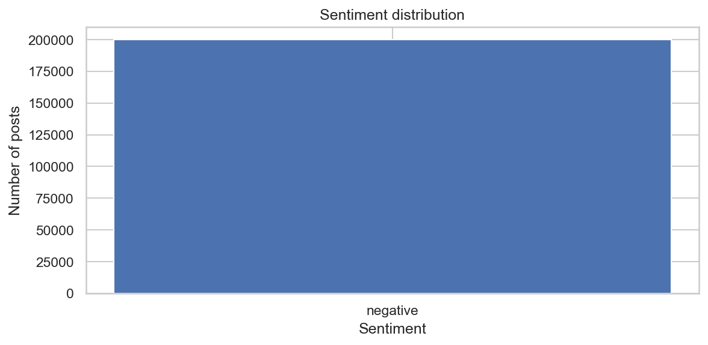
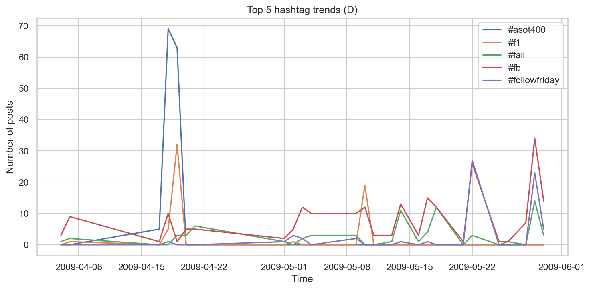
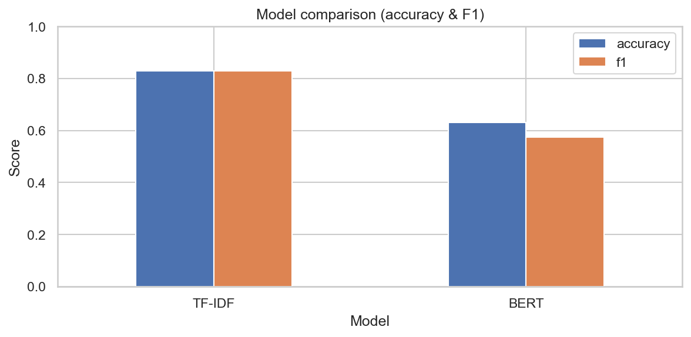

# 🚀 AI‑Driven Social Media Analytics for Trend and Behavior Prediction


An end‑to‑end AIML system that:
- 🤖 predicts **sentiment** from social posts (TF‑IDF baseline + optional BERT)
- 🔥 detects **trending hashtags** over time
- 📈 forecasts **future trend strength** using an LSTM
- 🧩 serves predictions via **FastAPI** and a **Streamlit** dashboard

> ✅ One‑command execution: `python run_pipeline.py --fast` or `--full`

---

## 1) 🌍 Project Overview

### What problem does it solve?
Social media data is noisy, fast‑changing, and huge. This project automates:
- **Sentiment classification** (positive/negative)
- **Trend mining** (what people are talking about)
- **Trend forecasting** (where the conversation might go next)

### Why is it important?
- Helps organizations understand public opinion in near real‑time
- Enables early detection of emerging topics and behavior patterns
- Supports data‑driven decisions for marketing, crisis response, and product feedback

### Real‑world use cases
- 🏢 Brand monitoring: track sentiment and trending issues
- 🗳️ Event analysis: detect spikes around launches, sports, elections
- 🧑‍💻 Community health: identify rising complaints or harmful trends
- 📣 Campaign tracking: forecast hashtag engagement over time

---

## 2) 🎬 Demo Preview

### Sentiment output example (FastAPI)

```bash
curl -X POST "http://127.0.0.1:8000/sentiment" \
  -H "Content-Type: application/json" \
  -d '{"text":"I love this project! The results are awesome."}'
```

Example response:

```json
{
  "label": "positive",
  "score": 0.93,
  "model": "tfidf_logreg"
}
```

### Graph outputs
Generated automatically under `outputs/plots/` (no GUI needed).

### Streamlit UI
This repo includes a full dashboard UI:

```bash
streamlit run app.py
```

---

## 3) ✨ Features

- 😊 **Sentiment Analysis**
  - TF‑IDF + Logistic Regression (fast baseline)
  - BERT fine‑tuning (optional; heavier)
- 🔥 **Trend Detection**
  - Hashtag extraction + daily/weekly aggregation
  - Top overall + top latest window
- 📈 **LSTM Forecasting**
  - Time series forecasting of hashtag frequency
  - Produces future predictions saved to JSON
- ⚡ **FastAPI Backend**
  - `/sentiment`, `/trends`, `/predict`
  - Loads models from `artifacts/` (no retraining required)
- 🖥️ **Streamlit Frontend**
  - Production‑style navigation & dashboards
  - Reads from `artifacts/` and `outputs/`

---

## 4) 🏗️ Project Architecture

### Pipeline (end‑to‑end)

**Data → Preprocessing → Models → Outputs → API → UI**

```text
data/*.csv
  ↓
run_pipeline.py
  ├─ preprocessing (NLTK clean_text sample)
  ├─ TF‑IDF training/loading → artifacts/sentiment_tfidf.joblib
  ├─ (optional) BERT training/loading → artifacts/bert_sentiment/
  ├─ trend detection → outputs/trends/
  ├─ (optional) LSTM training/loading → artifacts/hashtag_lstm.pt
  └─ plots + metrics → outputs/plots/ + outputs/metrics/
                         ↓
                FastAPI (api/) + Streamlit (app.py)
```

Key design decision: **Artifacts are reused** if already trained (fast reruns).

---

## 5) 📁 Complete Folder Structure (with 1‑line explanations)

### Top‑level

```
aiml-social-analytics/
  api/
  artifacts/
  data/
  outputs/
  scripts/
  app.py
  run_pipeline.py
  test_api.py
  eda_social_media.py
  baseline_sentiment_model.py
  bert_sentiment_model.py
  hashtag_trends.py
  lstm_hashtag_forecast.py
  visualizations.py
  PROJECT_REPORT.md
  requirements.txt
```

### What each major file/folder does

- `run_pipeline.py` → master orchestrator (fast/full), writes everything to `outputs/`, reuses `artifacts/`
- `app.py` → Streamlit frontend UI (no retraining)
- `test_api.py` → smoke test for `/sentiment`, `/trends`, `/predict` using TestClient
- `requirements.txt` → reproducible environment (pip freeze)
- `PROJECT_REPORT.md` → college‑submission style report

- `eda_social_media.py` → EDA + NLTK preprocessing to create `clean_text`
- `baseline_sentiment_model.py` → standalone TF‑IDF + Logistic Regression baseline training/evaluation
- `bert_sentiment_model.py` → standalone BERT fine‑tuning + baseline comparison
- `hashtag_trends.py` → standalone hashtag extraction + trend aggregation + plotting
- `lstm_hashtag_forecast.py` → standalone LSTM time‑series forecasting script
- `visualizations.py` → saves PNG plots (sentiment distribution, trends line plot, model comparison)

- `scripts/train_artifacts.py` → trains + saves TF‑IDF and LSTM artifacts used by the API

- `api/main.py` → FastAPI entry point + endpoints + lifecycle model loading
- `api/config.py` → environment‑variable settings (paths + training defaults)
- `api/schemas.py` → Pydantic request/response models
- `api/services/sentiment.py` → TF‑IDF model training/loading/saving + `predict()` wrapper
- `api/services/trends.py` → trend computation + caching of hashtag counts
- `api/services/forecast.py` → LSTM train/load + forecasting utilities
- `api/services/hashtag_data.py` → shared hashtag extraction + timestamp parsing + time bucketing

- `data/training.1600000.processed.noemoticon.csv` → Sentiment140‑style dataset (no header)
- `artifacts/` → saved models (TF‑IDF joblib, LSTM .pt, optional BERT folder)
- `outputs/` → generated JSON/CSV/plots/logs (safe to delete and regenerate)

---

## 6) 🧰 Installation Guide (Beginner‑Friendly)

### Prerequisites
- Python (tested on **Python 3.14.3** on Windows)
- Recommended: create a virtual environment

### Setup

```powershell
python -m venv .venv
.\.venv\Scripts\Activate.ps1
python -m pip install --upgrade pip
pip install -r requirements.txt
```

### Dataset (required)
This repo does **not** include the full dataset CSV because GitHub rejects files larger than 100MB.

Place the Sentiment140-style training file at:
- `data/training.1600000.processed.noemoticon.csv`

> The file is expected to be **latin-1**, **no header**, with 6 columns (Sentiment140 format).

> Note: NLTK resources may auto‑download the first time preprocessing runs.

---

## 7) ▶️ Usage

### A) Run the full project end‑to‑end (ONE command)

Fast mode (recommended; skips BERT + LSTM training):

```powershell
python run_pipeline.py --fast
```

Full mode (runs everything; slower on CPU):

```powershell
python run_pipeline.py --full
```

### B) Run the FastAPI backend

```powershell
python -m uvicorn api.main:app --reload
```

Endpoints:
- `POST /sentiment`
- `GET /trends?top_n=10&group_freq=D&window=60`
- `POST /predict`

Smoke test (no server needed):

```powershell
python test_api.py
```

### C) Run the Streamlit frontend

```powershell
streamlit run app.py
```

---

## 8) 📦 Outputs

### Plots (PNG)







### Key output files
- `outputs/metrics/model_metrics.json` → TF‑IDF + (optional) BERT metrics
- `outputs/trends/trends_D.json` → trend summary (top overall + latest + series)
- `outputs/forecast/forecast.json` → LSTM forecast results (full mode)
- `outputs/logs/pipeline.log` → run logs

---

## 9) 🤖 Model Explanation (Beginner‑Friendly)

### TF‑IDF + Logistic Regression
- **TF‑IDF** converts text into a numeric vector based on word importance.
- **Logistic Regression** learns a linear decision boundary on those vectors.
- Pros: fast, strong baseline, easy to deploy.

### BERT (Transformer)
- BERT reads text as a **sequence** and learns **contextual meaning**.
- Fine‑tuning adapts a pretrained model to your sentiment labels.
- Pros: powerful when tuned well; Cons: heavier compute, especially on CPU.

### LSTM (Time‑Series Forecasting)
- Converts hashtag counts (daily/weekly) into a time series.
- LSTM learns patterns from a sliding window (`lookback`) and predicts future values.

---

## 10) 🧪 Results Summary

Metrics are taken from `outputs/metrics/model_metrics.json` generated by the pipeline.

| Model | Accuracy | Precision | Recall | F1 |
|------|----------:|----------:|-------:|---:|
| TF‑IDF + Logistic Regression | 0.8278 | 0.8260 | 0.8305 | 0.8282 |
| BERT (small, 1 epoch, CPU) | 0.6305 | 0.6766 | 0.5000 | 0.5750 |

**Observation:** With a CPU‑friendly setup (small BERT + 1 epoch), TF‑IDF outperformed BERT.
With a GPU, more epochs, and tuning, BERT typically improves.

---

## 11) 🔮 Future Scope

- Train a stronger transformer (GPU + more epochs + better hyperparameters)
- Forecast multiple hashtags (multi‑series models)
- Add burst detection / anomaly detection for trend spikes
- Improve preprocessing (emoji sentiment, negation handling, domain tokenization)
- Add production hardening (auth, rate limits, monitoring, Docker)

---

## 12) 👤 Author / Contribution

### Author
- Name: *(add your name here)*
- Institute / Course: *(add details)*

### Contribution
Contributions are welcome:
- Fork the repo
- Create a feature branch
- Open a PR with a clear description + test notes

---

## 📄 License

License is currently **not specified**. If you plan to publish this project, add a `LICENSE` file and update the badge above.
